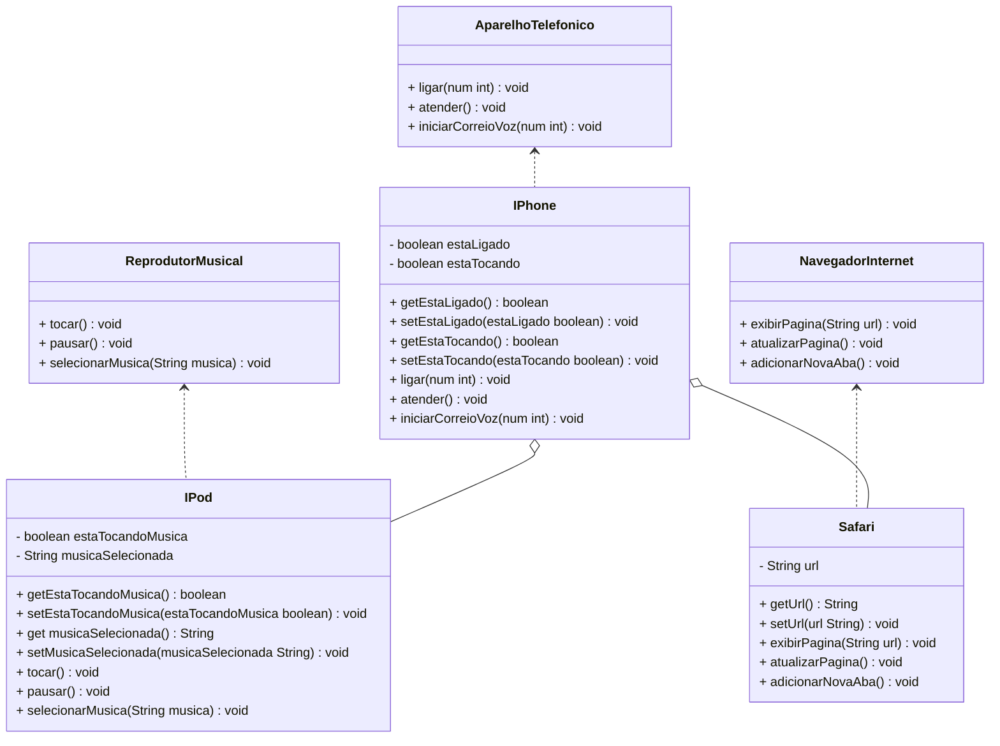

<h1 align="center">  POO - Desafio </h1>

## :dart: Modelagem e Diagramação de um Componente iPhone

Com base no vídeo de lançamento do iPhone de 2007 modelar e diagramar a representação UML do componente iPhone, abrangendo suas funcionalidades como Reprodutor Musical, Aparelho Telefônico e Navegador na Internet.

[Lançamento iPhone 2007](https://www.youtube.com/watch?v=9ou608QQRq8)

#### Funcionalidades
1. **Reprodutor Musical**
    - Métodos: `tocar()`, `pausar()`, `selecionarMusica(String musica)`
2. **Aparelho Telefônico**
    - Métodos: `ligar(int num)`, `atender()`, `iniciarCorreioVoz()`
3. **Navegador na Internet**
    - Métodos: `exibirPagina(String url)`, `adicionarNovaAba()`, `atualizarPagina()`

## :pushpin: Objetivo
1. Criar um diagrama UML que represente as funcionalidades descritas.
2. Implementar as classes e interfaces correspondentes em Java.

## :writing_hand: Diagrama UML (Mermaid)

O diagrama abaixo foi desenvolvido na sintaxe [Mermaid](https://mermaid.js.org/), uma alternativa open-source compatível com arquivos Markdown.

## :desktop_computer: IDE

Este projeto foi desenvolvido utilizando a IDE IntelliJ IDEA.

Você pode baixá-la em: [jetbrains.com/idea](https://www.jetbrains.com/idea/)